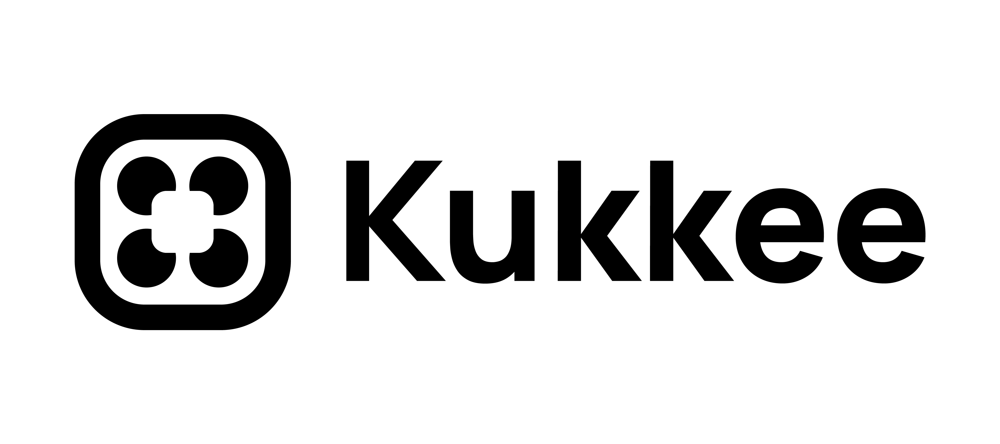

[](https://kukkee.com)

### Never ask “what time works for you all?” again. [Try now](https://kukkee.com)!

[](https://github.com/Kukkee/Kukkee/blob/main/LICENSE)
[](https://gitter.im/Kukkee/community)
[](https://codeclimate.com/github/Kukkee/Kukkee)
[](https://github.com/Kukkee/Kukkee/graphs/contributors)

## Community

Come say hello at our [chatroom](https://gitter.im/Kukkee/community) for discussions, voicing new ideas or getting help!

## Getting Started

### Prerequisites

- `NodeJS v14`

### Installation

- Fork the repository

```bash
$ git clone https://github.com/<your-github-handle>/Kukkee.git

$ cd Kukkee

$ npm i
```

### Setup

- Make a copy of the `.env.development.example` and `.env.production.example` files to `.env.development` and `.env.production` files respectively.
- Create a firebase account , setup firebase authentication for google sign-in (firebase-console > Authentication > Sign-in methods > Google ), whitelist the client domain in the `Authorised domains` section. Set firebase config variables in `.env` files.
- Set the encryption variables and domain URLs in the `.env` files

### Development

Make sure that the [Kukkee-server](https://github.com/Kukkee/Kukkee-server) is located at the level same as this repository with the relevant `node_modules` installed.

The structure should like the following:  
/  
├── Kukkee-server/  
└── Kukkee/

```bash
$ npm run script
```

Linting

```bash
$ npx eslint . --ext .tsx,.ts
```

> Note: Or simply setup automatic linting in `vscode`

Testing

```bash
$ npm run test
```

### Production

```bash
$ npm run build

$ npm start
```

## Deployment

Make a copy of the `.env.production.example` file to `.env.production` and set the environment variables.

## Deploy with vercel

> Note: You need to have the [Kukkee-server](https://github.com/Kukkee/Kukkee-server) setup before using this one-click deployment. Make sure to create a firebase account and setup `firebase-auth` for google signin.

Set the environment variables in `.env.production.example` at Vercel in the next step.

[](https://vercel.com/new/git/external?repository-url=https%3A%2F%2Fgithub.com%2FKukkee%2FKukkee&project-name=Kukkee-demo&repository-name=Kukkee&demo-title=Kukkee%20Demo)

## Contributing

Check out our [contributing guide](https://github.com/Kukkee/Kukkee/blob/main/CONTRIBUTING.md)!

## License

Kukkee is distributed under the [MIT License](https://github.com/Kukkee/Kukkee/blob/main/LICENSE).
